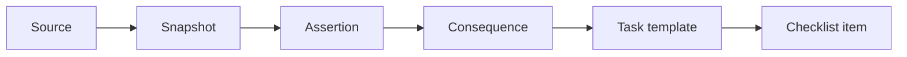

# Clarvia Graph

**Open consequence graph and public Clarvia monorepo for source-backed administrative workflows**

[](https://github.com/clarvia-org/clarvia-graph/actions/workflows/ci.yml)
[](https://github.com/clarvia-org/clarvia-graph/actions/workflows/validate-web.yml)
[](https://github.com/clarvia-org/clarvia-graph/actions/workflows/validate-lex.yml)
[](https://github.com/clarvia-org/clarvia-graph/actions/workflows/validate-lex-email.yml)
[](LICENSE)
[](https://www.bestpractices.dev/projects/13112)
[](https://scorecard.dev/#/projects/github.com/clarvia-org/clarvia-graph)
[](https://api.reuse.software/info/github.com/clarvia-org/clarvia-graph)
[](https://codecov.io/gh/clarvia-org/clarvia-graph)
[](https://sonarcloud.io/summary/new_code?id=clarvia-org_clarvia-graph)
[](LICENSE-DATA)
[](https://doi.org/10.5281/zenodo.20572455)
[](https://fair-software.eu)

[](https://clarvia.org/en/checklist)

> **Status:** CI passing · [OpenSSF Best Practices: passing](https://www.bestpractices.dev/projects/13112) · [OpenSSF Scorecard](https://scorecard.dev/#/projects/github.com/clarvia-org/clarvia-graph) · [REUSE compliant](https://api.reuse.software/info/github.com/clarvia-org/clarvia-graph) · [Codecov](https://codecov.io/gh/clarvia-org/clarvia-graph) · [SonarCloud](https://sonarcloud.io/summary/new_code?id=clarvia-org_clarvia-graph) · Code: EUPL-1.2 · Data: CC-BY-4.0 · [DOI: 10.5281/zenodo.20572455](https://doi.org/10.5281/zenodo.20572455) · [FAIR: 4/5](https://fair-software.eu)

Clarvia Graph is reusable public-interest digital infrastructure. While it serves as the technical engine behind the consumer-facing checklist at [clarvia.org](https://clarvia.org), it is designed as an open, source-backed administrative workflow repository. It structures official rules, deadlines, and requirements for bereavement paperwork so that any application, civic-tech portal, research project, or public service can consume and adapt them automatically.

This repository is Clarvia’s **public monorepo**: the consequence graph, the clarvia.org website, legislation data for agents (`lex/`), and the public-safe Lex email service (`services/lex/`) live here under path-filtered CI. See [`docs/MONOREPO.md`](docs/MONOREPO.md) for layout, licenses, and deploy boundaries.

## Quick start

Requires **Node 22+** and **pnpm 9.x** (see root `packageManager` / `.node-version`). Python 3.12+ is needed for `lex/` and `services/lex/`.

```bash
git clone https://github.com/clarvia-org/clarvia-graph.git
cd clarvia-graph
pnpm install
pnpm validate                 # graph
pnpm export-and-sync-web      # refresh website checklist data
pnpm web:dev                  # clarvia.org locally
```

Working on one area only? See sparse-checkout notes in [`docs/MONOREPO.md`](docs/MONOREPO.md) and [`CONTRIBUTING.md`](CONTRIBUTING.md). Package READMEs: [`apps/web`](apps/web/), [`lex/`](lex/), [`services/lex/`](services/lex/).

## Digital Public Good readiness

Clarvia Graph is being prepared for submission to the Digital Public Goods Alliance Registry as open, source-backed administrative workflow infrastructure for bereavement administration. See [DPG.md](DPG.md) for the DPG Standard mapping, open-license information, privacy and do-no-harm boundaries, SDG alignment, and reuse documentation.

<details>
<summary>📸 Alpha checklist preview</summary>

<br>


> The living demo at [clarvia.org/en/checklist](https://clarvia.org/en/checklist) consumes a static JSON export generated from this graph. See [`exports/example-bereavement-lu.json`](exports/example-bereavement-lu.json) for the exact shape.

</details>

---

Technically, Clarvia Graph is a structured, versioned, source-backed knowledge graph for cross-border administrative consequences. It models what happens after a life event (starting with bereavement), what steps may be required, which authorities are involved, what documents are needed, and where the official source says so.

**In this monorepo:**

| Path | Role | Runtime |
|---|---|---|
| `graph/`, `schemas/`, `vocab/`, `sources/`, `packages/*` | Consequence graph + validation/export tooling | Git + CI exports |
| [`apps/web`](apps/web/) | Public website (clarvia.org) | Coolify / GCE |
| [`lex/`](lex/) | Normalized national legislation for AI agents | Git + local CLI |
| [`services/lex/`](services/lex/) | Lex email automation (public-safe code) | Cloud Run (`europe-west1`) |

## Repository structure

```
clarvia-graph/
├── apps/
│   └── web/          # Next.js site (clarvia.org) — Coolify/GCE
├── services/
│   └── lex/          # Lex email service (public-safe; Cloud Run)
├── lex/              # Legislation dataset + CLI
├── schemas/          # JSON Schema definitions (v0.1)
├── vocab/            # Controlled vocabularies
├── graph/            # Consequence graph data (YAML)
│   ├── authorities/
│   ├── conditions/
│   ├── consequences/
│   ├── task_templates/
│   └── …
├── sources/          # Source registry, snapshots, and assertions
├── translations/     # Locale overlay files
├── tests/            # Scenario tests and unit tests
├── exports/          # Generated output (JSON, JSON-LD, web bundles)
├── packages/         # Workspace packages
│   ├── cli/          #   @clarvia/cli — validation, build, and export tooling
│   └── generator/    #   @clarvia/generator — checklist generation engine
├── docs/             # Foundation specification and guides (see MONOREPO.md)
└── build/            # Build output (git-ignored)
```

The root `package.json` is a [pnpm workspace](https://pnpm.io/workspaces) for `packages/*` and `apps/*`. Run `pnpm install` from the repository root. Website checklist data is synced in-repo via `pnpm export-and-sync-web` (not a cross-repo release pin). Python projects under `lex/` and `services/lex/` use their own `uv` / `pip` workflows.

## Status

🔒 **Foundation specification locked** — The [foundation spec](docs/FOUNDATION.md) defines the complete data architecture, standards alignment, editorial governance, and extensibility model.

🚧 **Early implementation in progress** — Proof-of-concept, alpha, and beta work is proceeding with internal resources to validate the foundation before funded hardening, validation, and scale-up phases.

## Development model

Clarvia Graph is being developed as the technical foundation for source-backed bereavement checklists and related administrative workflows across Europe.

The project is moving through rapid proof-of-concept, alpha, and beta phases. Early versions are built with internal resources so that the data model, graph structure, validation approach, and export pipeline can be tested before larger funding cycles conclude.

This early implementation work is not intended to replace funded development. It is intended to de-risk the technical foundation and demonstrate that the architecture can move from specification to working infrastructure.

Future funded phases will focus on raising the foundation to production quality: schema refinement, validation tooling, source provenance, test coverage, interoperability, documentation, governance, security hardening, maintainability, and support for multiple jurisdictions.

The intended path is to build quickly, learn from real implementation, and then use funded phases to validate, harden, document, and scale the graph responsibly.

## Architecture



Every checklist item traces back to an official source. No legal consequence publishes without an approved source assertion.

## Key design decisions

- **Source-backed**: Every published claim traces to a captured official source
- **Three-valued logic**: Conditions evaluate to `true`, `false`, or `unknown` — never hides uncertainty
- **Cross-border**: Jurisdiction roles (death_place, habitual_residence, work_state, asset_situs) compose layered checklists
- **Static exports**: Consumer apps load generated JSON at build time — no runtime API dependency
- **Privacy-first checklist**: Checklist conditions are evaluated client-side, so personal circumstances are not sent to Clarvia’s servers for checklist generation. Separate services such as Lex process information as described in Clarvia’s [Privacy & Cookie Policy](https://clarvia.org/en/privacy).
- **Public/private fence**: Production secrets and live Lex prompts stay out of this repository (see [`docs/MONOREPO.md`](docs/MONOREPO.md))

## Software quality and reproducibility

This repository uses automated quality checks for tests, linting, static analysis, dependency and security scanning, documented installation, reproducible examples, citation metadata, licensing information, and archived releases. Path-filtered CI runs graph, web, legislation, and Lex email checks on every relevant pull request and release.

## Standards

Clarvia maintains internal Clarvia-native schemas and generates compatibility views for:
- **CPSV-AP** — Core Public Service Vocabulary Application Profile
- **CCCEV** — Core Criterion and Core Evidence Vocabulary
- **ELI** — European Legislation Identifier
- **PROV-O** — W3C Provenance Ontology

> **Planned for next release:** integrate [`prov`](https://github.com/trungdong/prov) Python library for PROV-O exports.
>
> **Planned:** use [`SEMICeu/CPSV-AP`](https://github.com/SEMICeu/CPSV-AP) and [`SEMICeu/CCCEV`](https://github.com/SEMICeu/CCCEV) official SHACL shapes as validation targets for CPSV-AP and CCCEV exports.

## Scope

**v0.1 technical validation scope:** Bereavement workflows, Luxembourg proof dataset, and minimal cross-border fixtures for France/Germany/EU concepts where needed to test jurisdiction composition.

**Designed for extension to:** Additional jurisdictions (Belgium, Netherlands, ...) and life events (birth, relocation, ...) without schema changes.

## Reuse and adaptation

Clarvia Graph is an open, source-backed knowledge graph for administrative consequences — designed so that others can study the architecture, adapt the schemas, and fork for their own regulatory domains.

The provenance chain, three-valued condition logic, publication gate, and EU standards alignment are domain-agnostic patterns. The bereavement/Luxembourg dataset is a working reference implementation. If you are building source-backed regulatory workflows for a different life event or jurisdiction, this repository provides a tested starting point.

## Funding

Clarvia Graph is maintained by Clarvia ASBL, a Luxembourg-registered nonprofit.

Our current funding needs and contribution channels are published in the project's [`funding.json`](funding.json) manifest.

Current priority: an adoption-ready first release covering stable versioning, documentation, reproducible examples, validation, automated testing, governance, and independent technical review.

## License

Licenses are **path-scoped** (REUSE-compliant):

| Area | License |
|---|---|
| Graph code & tooling (`packages/`, most root tooling) | [EUPL-1.2](LICENSE) |
| Graph data, vocab, schemas, docs | [CC-BY-4.0](LICENSE-DATA) (see REUSE.toml) |
| Website (`apps/web`) | [Apache-2.0](apps/web/LICENSE) |
| Legislation project code (`lex/` authored code) | [Apache-2.0](lex/LICENSE) |
| Official legislation corpus files | Source-specific (not relicensed; see `lex/NOTICE`) |
| Lex email public-safe code (`services/lex/`) | Apache-2.0 |
| Captured government HTML snapshots | LicenseRef-Gov-PublicDomain |

## Contributing

See [CONTRIBUTING.md](CONTRIBUTING.md) for how to get involved. Package-level notes live under `apps/web/`, `lex/`, and `services/lex/`.

## Supporters and Pilot Partners

We are grateful for the support of ecosystem partners who have endorsed Clarvia’s public-interest mission, including **[Trauerwee ASBL](https://trauerwee.lu/)**, which has expressed its intention to support a future pilot, and **[TSC Real Estate](https://www.tsc-realestate.de/en/)**, which has endorsed our public-interest goals.

## Related material

| Path / link | Role |
|---|---|
| [`docs/MONOREPO.md`](docs/MONOREPO.md) | Monorepo map, CI, deploy boundaries |
| [`apps/web`](apps/web/) | Website package (formerly `workflow-web`) |
| [`lex/`](lex/) | Legislation dataset + CLI (formerly standalone `clarvia-org/lex`) |
| [`services/lex/`](services/lex/) | Lex email service (public-safe) |
| [workflow-data](https://github.com/clarvia-org/workflow-data) | **Archived** — legacy checklist data superseded by this graph |
| [clarvia-org/.github](https://github.com/clarvia-org/.github) | Organization community health files |

## Acknowledgements

[HirenGajjar](https://github.com/HirenGajjar) built the original cross-border bereavement dataset in `workflow-data` — source records, institution registries, and corridor documentation for Belgium, France, Germany, and Portugal. That work materially accelerated the graph's cross-border coverage and now lives here as migrated authority, source, and condition records.
